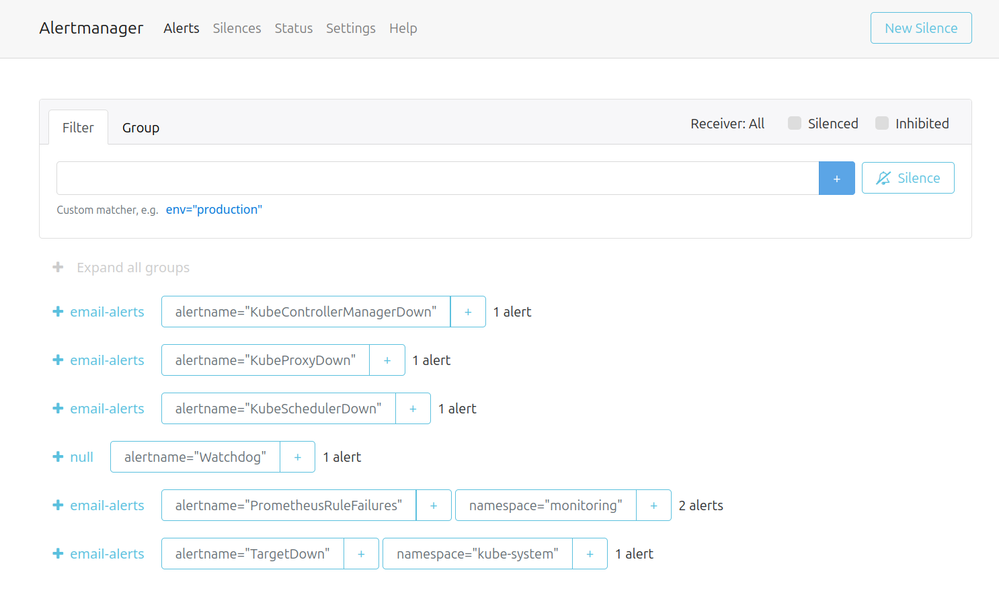

#Txt2Img 


## Table of contents

<!--ts-->
- [Table of contents](#table-of-contents)
- [Overal architecture](#overal-architecture)
- [Project structure](#project-structure)
- [Getting Started](#getting-started)
  - [Prepare enviroment](#prepare-enviroment)
- [On-premise deployment](#on-premise-deployment)
  - [Running application docker container in local](#running-application-docker-container-in-local)
- [Cloud migration](#cloud-migration)
  - [Application service deployment in GKE](#application-service-deployment-in-gke)
    - [Create a project in GCP](#create-a-project-in-gcp)
    - [Install gcloud CLI](#install-gcloud-cli)
    - [Install gke-cloud-auth-plugin](#install-gke-cloud-auth-plugin)
    - [Using terraform to create GKE cluster](#using-terraform-to-create-gke-cluster)
    - [Install kubectl, kubectx and kubens](#install-kubectl-kubectx-and-kubens)
      - [Deploy nginx ingress controller](#deploy-nginx-ingress-controller)
      - [Deploy model serving service](#deploy-model-serving-service)
      - [Make changes to the kube-prometheus-stack helm file](#make-changes-to-the-kube-prometheus-stack-helm-file)
      - [Deploy monitoring service](#deploy-monitoring-service)
  - [Demo](#demo)
         


<!--te-->

## Overal architecture


## Project structure
```bash
project-root/
├── .gitignore                   # Git ignore file
├── deployment/                  # Deployment configurations
│   ├── app/
│   └── jenkins/
├── helm/                        # Helm charts
│   ├── calculator-app/          # Calculator app chart
│   ├── grafana-prometheus/      # Monitoring stack
│   └── nginx-ingress/           # Ingress controller
├── images/                      # Images for documentation
├── terraform/                   # Infrastructure as Code
│   ├── main.tf
│   ├── variables.tf
│   └── output.tf
├── Makefile                     # Build automation
├── README.md                    # Documentation
├── app.py                       # Main application file
└── hw3_key.json                 # Service account key (should be ignored)
```
## Getting Started

To get started with this project, we will need to do the following

### Prepare enviroment 

Clone the repository to your local machine.

`git clone https://github.com/DevOps-NT548/HW3.git`

Install all dependencies dedicated to the project

```bash
conda create -n nt548 python=<python_version> # Here I used version 3.9.18
conda activate nt548
pip install -r requirements.txt
```

## On-premise deployment

### Running application docker container in local 

- Build and run the Docker image using the following command

```bash
make app_local_up
```

Navigating deployement model using `localhost:8501/docs` on host machine


## Cloud migration


Deploying your ML application on-premises imposes various constraints and limitations, hindering scalability, flexibility and security as well. However, migrating your ML application to Google Cloud Platform (GCP) offers a strategic advantage, enabling to leverage scalable infrastructure, advanced analytics, and managed services tailored for machine learning workflows.

### Application service deployment in GKE

To migrate our application service to the cloud using Google Cloud Platform (GCP), we'll start by enabling the Kubernetes Engine API as shown below:


#### Create a project in GCP

First we need to create a project in [GCP](https://console.cloud.google.com/projectcreate?hl=vi&pli=1)

#### Install gcloud CLI
- gclound CLI can be installed in the following document

- Initialize gclound CLI, then type Y

```bash
gcloud init
Y
```
- A pop-up will prompt us  to select your Google account. Select the account associated with your GCP registration and click `Allow`.

- Go back to your terminal, in which you typed `gcloud init`, type 1, and Enter.

- Then type Y, select the GCE zone corresponding to us-central-1a (in my case), then Enter.


#### Install gke-cloud-auth-plugin

In the next step, we'll install the GKE Cloud Authentication Plugin for the gcloud CLI tool. This plugin facilitates authentication with GKE clusters using the gcloud cli.

We can install the plugin using the following command:

`sudo apt-get install google-cloud-cli-gke-gcloud-auth-plugin`

This command will install the necessary plugin for authenticating with GKE clusters.

#### Using terraform to create GKE cluster

Terraform is a powerful infrastructure as code tool that allows us to define and provision infrastructure in a declarative manner. It helps to facilitate to automate the creation, modification, and deletion of infrastructure resources across various cloud providers.

To provision a GKE cluster using Terraform, follow these steps:

- We should update the invidual project ID, the corresponding GKE zone and its node machine. In my case, a gke cluster will be deployed in zone `us-central-1a` with its node machine is: 

```bash 
cd terraform
terraform init  # Initialize Terraform in the directory
terraform plan  # Plan the configuration
terraform apply # Apply the configuration to create the GKE cluster
```

- A created cluster will be pop up in GKE UI (after 8 to 10 minutes)


- connect to gke cluster using `gcloud cli` (Replace \<cluster-name>, \<cluster-zone>, \<project-name> with your corresponding values).

```bash
gcloud container clusters get-credentials <cluster-name> --zone=<cluster-zone> --project=<project-name>
```
- To view your highlighted cluster ID in the terminal, you can use the `kubectx` command.

#### Install kubectl, kubectx and kubens

Ensure that we have these tools to manage k8s cluster

What are kubectx and kubens?

- kubectx is a tool to switch between contexts (clusters) on kubectl faster.
- kubens is a tool to switch between Kubernetes namespaces (and configure them for kubectl) easily.

To install these tools, follow the instructions provided in the following section: https://github.com/ahmetb/kubectx#manual-installation-macos-and-linux.

In my case kubens and kubectl cli were saved in `usr/local/bin/`.

##### Deploy nginx ingress controller

An Ingress controller is a specialized load balancer for k8s enviroment, which accept traffic from outside the k8s platform, and load balance it to application containers running inside the platform. 

Deploy Nginx ingress controller in corresponding name space in following commands: 

```bash
cd helm/nginx-ingress    
kubectl create ns nginx-ingress # Create a K8s namespace nginx-ingress
kubens nginx-ingress            # switch the context to the newly created namespace 'nginx-ingress'
helm upgrade --install nginx-ingress-controller . # Deploy nginx Ingress 
```

Verify if the pod running in the specified namespace nginx-ingress
```bash
kubectl get pods -n nginx-ingress
```


##### Deploy model serving service

I decided to deploy the application container on GKE within the calculator namespace. Two replicas will be created, corresponding to the two pods.

- Deploy calculator app:

```bash
cd helm/calculator-app
kubectl create ns model-serving
kubens model-serving
helm upgrade --install calculator-app .
```

- Get IP address of nginx-ingress
```bash
kubectl get ing
```

- Add the domain name `calculator.com` of this IP to `/etc/hosts` where the hostnames are mapped to IP addresses. 

Alternatively, you can utilize the wildcard DNS service provided by *.nip.io, eliminating the need to manually edit the `/etc/hosts` file. This service allows you to access your service using a domain name based on the IP address. For example, if your IP address is `192.168.1.100`, you can access your service using `192-168-1-100.nip.io`.

```bash
sudo nano /etc/hosts
[INGRESS_IP_ADDRESS] calculator.com
```

##### Make changes to the kube-prometheus-stack helm file

In the /helm/grafana-prometheus/kube-promethus-stack/values.yaml file, replace the recipient's email with your email so alert manager can send alerts to your email.


##### Deploy monitoring service

```bash
cd helm/grafana-prometheus/kube-prometheus-stack/
kubectl create ns monitoring
kubens monitoring
helm dependency build
helm upgrade --install kube-grafana-prometheus .
```

- Check if pods are running within a namespace in Kubernetes, you can use the kubectl  in monitoring namespace:

```bash
kubectl get pods -n monitoring
```

- Add all the services of this external IP to `/etc/hosts`, including:

```bash
sudo nano /etc/hosts
[INGRESS_IP_ADDRESS]  grafana.monitoring.com
[INGRESS_IP_ADDRESS]  promeutheus.monitoring.com
[INGRESS_IP_ADDRESS]  alertmanager.monitoring.com
```

To get grafana credentails, you could launch the following command to access the enviroment variable from the container, for example:

```bash
kubectl exec kube-grafana-prometheus-d5c9d4696-z6487 -- env | grep ADMIN
```
When I describe the pod, it states the ENV variable will be set from the secret:

```bash
Environment:
    GF_SECURITY_ADMIN_USER:      <set to the key 'admin-user' in secret 'kube-prometheus-stack-grafana'>      Optional: false
    GF_SECURITY_ADMIN_PASSWORD:  <set to the key 'admin-password' in secret 'kube-prometheus-stack-grafana'>  Optional: false
```

### Demo 

To explore the Disaster classification API, you can access http://calculator.com/docs. This endpoint provides a comprehensive overview of the API's functionality, allowing you to test its capabilities effortlessly.


For monitoring the resource quotas across namespaces within our Kubernetes cluster, Grafana provides an intuitive interface accessible via grafana.monitoring.com. This dashboard offers insights into resource utilization, including CPU, memory, and more, for each pod within the cluster.

Moreover, we've implemented a custom dashboard in Grafana to monitor specific resource metrics, such as CPU usage, for pods within the `model-serving` namespace. This provides targeted insights into the performance of critical components within our infrastructure.


Alerts can be seen from http://alertmanager.monitoring.com. Any alert in critical severity will be noted by prometheus and starts in pending state, after 2 minutes, if it still has critical severity, it will receive the firing state and alert manager will send emails to the recipient notifying the problem.




